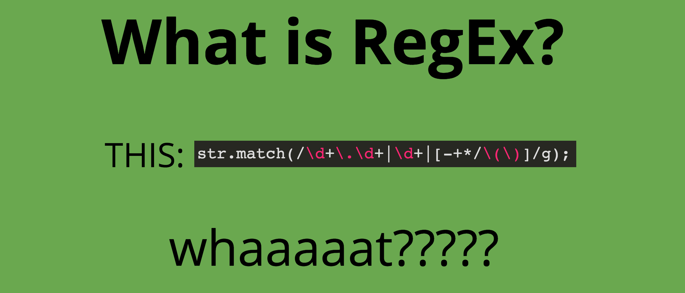

# LEXGEN (LAG) 

LEXGEN or as we like to call it LAG (**L**exical **A**nalyzer **G**enerator) is *phase 1* assignment of a **compiler frontend pipeline**. This work is done as the project for PLT (**P**rogramming **L**anguage **T**ranslation) course at Alexandria University, Faculty of Engineering Computer and Communications Department, offered in Spring 2020.

 Made with <b>love</b> :heart: and <b>hard work</b> :rocket:

**But, What's LAG really ?**

A LAG's objective is to produce a lexical analyzer automatically by specifying the lexeme patterns. This approach makes it easier to modify a lexical analyzer, since we have only to rewrite the affected patterns, not the entire program. It also speeds up the process of implementing the lexical analyzer, since the programmer specifies the software at the very high level of patterns and relies on the generator to produce the detailed code.

We begin the documentation of our LAG by explaining the first component, the **language parser** with giving a brief about regular expressions, a convenient notation for specifying lexeme patterns then show how did we transform this notation into *nondeterministic automata* using **NFA** component
and then into *deterministic automata* using **DFA** component to feed into another component which is the **Minimal DFA** component

We lastly explain the last component of our LAG which is a **driver**, that is, code which simulates these automata and uses them as a guide to determining the next token. This driver and the specification of the automaton form the nucleus of the lexical analyzer.

---

## Component :one: : Language Parser

- In other words, it is the lexical rules file reader, that parses lexemes specification.

- Takes an input file with format specified in requirements document.

- Emits an output with (Table of Inputs & List of Regular Expressions).

### Background: RE (Regular Expressions)

- A convenient notation for specifying lexeme patterns.
- While they cannot express all possible patterns, they are very effective in specifying those types of patterns that we actually need for tokens.
- Regular expressions notation has come into common use for describing all the languages that can be built from language operators applied to the symbols of some alphabet.
- Each regular expression r denotes a language L(r), which is also defined recursively from the languages denoted by r's sub-expressions.
- Regular expressions often contain unnecessary pairs of parentheses. We may drop certain pairs of parentheses if we adopt the conventions that:

  - The **unary operator** `*` has highest precedence and is left associative.
  - **Concatenation** has second highest precedence and is left associative.
  - **Union** `|` has lowest precedence and is left associative.
  - We may replace the regular expression `(a)|((b)\*(c))` by `a|b\*c.`

- A language that can be defined by a regular expression is called a **regular set**. If two regular expressions r and s denote the same regular set, we say they are equivalent and write r = s.

### Background: RD (Regular Definitions)

- We may wish to give names to certain regular expressions and use those names in subsequent expressions, as if the names were themselves symbols.

### Language Lexical Rules Input File Format

- No specific extension for the file is required. But should only contain ASCII characters.

- *Regular definitions* are lines in the form **LHS = RHS**.

- *Regular expressions* are lines in the form **LHS: RHS**.
- Note that `:` and `=` are not reserved by the rules 
- **Keywords** are enclosed by **`{ }`** in separate lines and a *space* between each keyword in the list.

- **Punctuations** are enclosed by **`[ ]`** in separate lines and a *space* between each punctuation in the list.

- **`\L`** represents *Lambda* symbol.

- **Supported Operations: `-` `|` `+` `*` `(` `)`**
- Any reserved symbol from the previous needed to be used within the language itself, is preceded by an **escape backslash character** `\` .

### Implementation Details

Two classes resembles this component work.

- RegularExpression
- LanguageParser

**RegularExpression** class resembles the RE entity we described a brief about it above.

- Use `RegularExpression regex(name, value);` to create an instance of the class.

- Use `regex.applyRangeOperationIfExists()` to enumerate the range operation and expand it into multiple union operators.

- Use `regex.extractInputSymbols()` to retrieve the input symbols available from the regex in an `unordered_set` of strings.

- Use `getName()` and `getValue()` to retrieve the params of this regex at any time.

**LanguageParser** class resembles the RE entity we described a brief about it above.

- Use `LanguageParser parser();` to create an instance of the class.

- Use `parser.parseFile(filepath)` to parse a language lexical rules file and convert it into the two following data-structures:

  - `unordered_set<string> InputTable`
  - `vector<RegularExpression> Expressions`

- Use `parser.getInput_table()` to retrieve the input table as above data structure.

- Use `parser.getExpressions()` to retrieve the list of expressions as above data structure.

---

## Component :two: : NFA-GEN

This component is required to construct a
**non-deterministic finite automata (NFA)** for the given regular expressions, combine these
NFAs together with a new starting state to produce one final NFA.

### Background: Finite Automata

These are essentially graphs, like transition diagrams, with a few differences:

- Finite automata are recognizers ; they simply say &*"yes"* or *"no"* about each possible input string.

- Finite automata come in two flavors:

    1. **Nondeterministic nite automata (NFA)** have no restrictions on the labels of their edges. A symbol can label several edges out of the same state, and the empty string (Epsilon), is a possible label.

    2. **Deterministic nite automata (DFA)** have, for each state, and for each symbol of its in

We can represent either an NFA or DFA by a **transition graph**, where the nodes are states and the labeled edges represent the transition function. There is an edge labeled `a` from state `s` to state `t` if and only if `t` is one of the next states for state `s` and input `a`.

### Implementation Details

We have a `NFAState` class that represents a single node in the NFA. There are two types of these states, it is either:

- An accepting state `NFAAcceptanceState` or,
- Non-accepting state `NFANormalState`.

The accepting state type has an extra attribute to hold the `token_name` it matches.
In general, each `NFAState` has an `id` attribute and a list that contains all the neighbours for this node.
The data structure used for the later is `vector < pair<string , NFAState *>> neighbours`. The pair is to hold both the transition input symbol and a pointer to the next node this node is connected to.

The main class of this component though is  the `NFAGen` class, that is the class responsible for generating the NFAs from each regex and then combining them all into one final NFA or transition graph.

- Use `NFAGen nfa_gen();` to generate a new instance of this class.
- Use `nfa_gen.regex_to_nfa(input_table, regex_list)` to parse both input table and the regex list that is the output of the previous component the language parser
  - They must be of the same data structure type of course.
  - At the end, a pointer to a `NFAState` is retrieved which resembles the root node of the whole final NFA generated from the regex.

The NFA-GEN takes advantage of the **McNaughton-Yamada-Thompson algorithm** to convert
a single regular expression to an NFA.
The algorithm is *syntax-directed*, in the sense that it works **recursively** up the parse tree for the regular expression. For each subexpression the algorithm constructs an NFA with a single accepting state.

    Method:
    -------
    - Begin by parsing r into its constituent subexpressions. 
    The rules for constructing an NFA consist of: 

    - basis rules for handling subexpressions with no operators and, 
    - inductive rules for constructing larger NFA's from the NFA's for the immediate subexpressions of a given expression.

More about the algorithm and rules of it can be found from section 3.7.4 in [1].

This way of implementation will allow us later to introduce and implement **LAG** in a **Pipes and Filters architecture** fashion but we will get back into that part in much detail later on. However, if you are familiar with this architecture already you can quite anticipate what we mean here.

---

## Component :three: : DFA-GEN

That component convert the resultingNFA to a DFA, minimize it and emit the transition table for the reducedDFA.
But, first let's mention the DFA in more depth.

### Background: Deterministic Finite Automata

A deterministic finite automaton (DFA) is a special case of an NFA where:

1. There are no moves on input (Epislon), and
2. For each state `s` and input symbol `a`, there is exactly one edge out of `s` labeled `a`.

While the NFA is an **abstract representation** of an algorithm to recognize the strings of a certain language, the DFA is a simple, concrete algorithm for recognizing strings.
It is fortunate indeed that every regular expression and every NFA can be converted to a DFA accepting the same language, because it is the DFA that we really implement or simulate when building lexical analyzers.

### Implementation Details

We represent DFA by the `DFAState` class and again by symmetry as the case with `NFAState`, there is two types of states:

- An accepting state `DFAAcceptanceState` or,
- Non-accepting state `DFANormalState`.

We use the **Subset Construction algorithm** to convert NFA's to DFA's.

    Method: 
    -------
    - The algorithm constructs a transition table D-tran for DFA.

    - Each state of DFA is a set of NFA states, and we construct D-tran so DFA will simulate "in parallel" all possible moves N can make on a given input string. 

    - A problem is to deal with Epsilon-transitions of NFA properly.

More about the algorithm and rules of it can be found from section 3.7.1 in [1].

The main class here is the `DFAGen`, again with symmetry with the idea of component 2.

- Use `DFAGen dfa_gen();` to generate a new instance of this class.

- Use `def_gen.GenerateDFA(NFAState &nfa_root_state, const std::unordered_set<std::string> &input_table)`

Again, we notice here how the `DFAGen` and `NFAGen` will be interleaved and connected together again with pipes and filters concept easily.  
Notice the need of `DFAGen` of not only the NFA state root node but also a version of the input table that is modified by `NFAGen`.

### Minimization of DFA

There can be many DFA's that recognize the same language. If we implement a lexical analyzer as a DFA, we would generally prefer a DFA with as few states as possible, since each state requires entries in the table that describes the lexical analyzer.

It turns out that **there is always a unique (up to state names) minimum
state DFA** for any regular language. Moreover, this minimum-state DFA can be
constructed from any DFA, for the same language by grouping sets of equivalent states.

#### State Minimization Algorithm

The general idea of the **state-minimization algorithm** works by partitioning the states of a DFA
into groups of states that cannot be distinguished. Each group of states is then merged into a single state of the minimum-state DFA.

The algorithm works by maintaining a partition, whose groups are sets of states that have not yet been distinguished, while any two states from different groups are known to be
distinguishable. When the partition cannot be re ned further by breaking any
group into smaller groups, we have the minimum-state DFA.

More about the algorithm and rules of it can be found from section 3.9.6 in [1].

#### Dead State

The minimization algorithm produces a DFA with one dead state. This state is technically needed, because a DFA must have a transition from every state on every symbol. **We represent the dead state with ID of 0.**

#### Transition Table

For the minimal DFA produced, we construct a transition table that maps the state to each input symbol and what state does it go to eventually.

Columns are the input symbols + a column for source states.
Each row is a map between the source state and destination states under certain input symbols specified in header above. This table is output formatted as a **CSV (Spreadsheet) file**.

---

## Component :four: : LexDriver

It is the lexical analyzer program that simulates the resulting DFA machine.
that simulates the resulting DFA machine.

### How it works

The generated lexical analyzer read its input one character at a time, until it finds the longest prefix of the input, which matches one of the given regular expressions.

- **If more than one regular expression matches some longest prefix of the input,** the driver break the tie in favor of the regular expression listed first in the regular specifications. (Priority-based)

- **If a match exists,** the lexical analyzer should produce the token class and the attribute value.

- **If none of the regular expressions matches any input prefix,** an error recovery routine is to be called to print an error message and to continue looking for tokens.

### Implementation Details

There are three implementation strategies:

- Table driven.
- Direct coded,
- Hand coded.

They differ in the details of their runtime costs. However, they all have
the same asymptotic complexity—constant cost per character, plus the cost
of roll back. The differences in the efficiency of well-implemented strategies change the constant costs per character but not the asymptotic complexity of scanning.

Our LexDriver follows the third strategy: **Hand-coded Strategy**.
Many compilers use hand-coded scanners. In an informal survey of commercial compiler groups, we found that a surprisingly large fraction used hand-coded scanners.
Similarly, many of the popular open-source compilers rely on hand-coded
scanners.

Hand-coded scanner can reduce the *overhead of the interfaces* between the
scanner and the rest of the system.
A careful implementation of this strategy can **improve the mechanisms** used to read and manipulate characters on input and the operations needed to produce a copy of the actual lexeme on
output.

More about the strategies and the implementation of such scanners from section 2.5 in [2].
Also section 3.2 about input buffering in [1] discusses some ways that the simple but important task of reading the source program can be speeded which we indeed follow and take into consideration in ou implementation.

---
