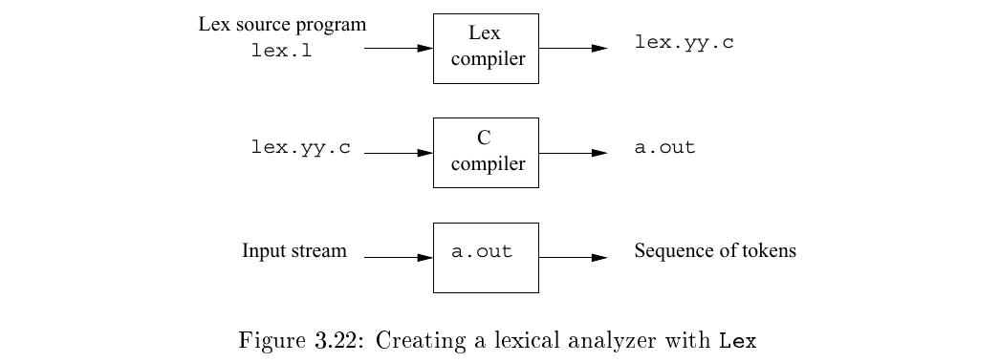
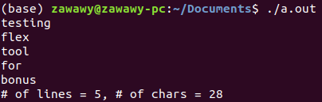
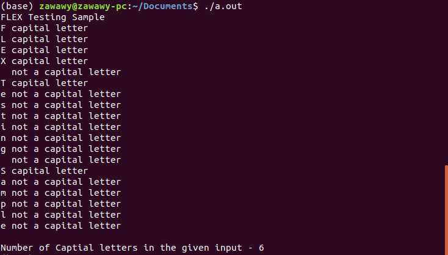

# FLEX Tutorial

As a bonus contribution on our work, we would like to add a tutorial of usage of Flex.
The tutorial includes a detailed description of the required steps together with screenshots for using the tool.

## What is FLEX

Flex (**F**ast **L**exical **A**nalyzer **G**enerator)is a tool for automatically generating scanners; that is programs which recognize lexical patterns in text for the given regular expressions.
FLEX is a tool for generating lexical analyzers (scanners or lexers) written by Vern Paxson in C around 1987. It is used together with Berkeley Yacc parser generator or GNU Bison parser generator. Flex and Bison both are more flexible than Lex and Yacc and produces faster code.

## How does it work

- The description is in the form of pairs of regular expressions and C code, called rules. flex generates as output a C source file, `lex.yy.c`,  which defines a routine `yylex()`.

- The function `yylex()` is the main flex function which runs the Rule Section and extension (.l or .lex ot .flex) is the extension used to save the programs. This uses the specification to recognize tokens.

- The file  `lex.yy.c` is compiled and linked with the C compiler to produce an executable. When the executable is run, it analyzes its input for occurrences of the regular expressions. Whenever it finds one, it executes the corresponding C code.

- Generally, the executable `a.out` take a stream of input characters and produce a stream of tokens. Let me remind you that the `a.out` is actually the scanner here!

## How to FLEX

- **Step 1:** Install Flex tool. In ubuntu this is done via `sudo apt-get install flex`.

- **Step 2:** Write an input file that describes the lexical analyzer to be generated. We will get back to the input file format structure in next section.

- **Step 3:** Compile the file named `lex.yy.c` using the command `gcc lex.yy.c`

- **Step 4:** Execute the executable produced file `a.out` using the command `./a.out`.

- **Step 5:** Use the lexical analyzer produced through the terminal by giving a possible input from the defined input stream and the program will produce a token accordingly.

## FLEX Input File Format

 The  flex input file consists of three sections, separated by a line with just `%%` in it:

    definitions
    %%
    rules
    %%
    user code

1. The **definitions** section contains declarations of simple name to simplify the scanner specification, as declaration of variables, regular definitions, and manifest constants. Anything written in this brackets is copied directly to the file lex.yy.c

        %{
        // Definitions
        %}

2. The **rules or patterns** section in the input are written  using  an extended set of regular expressions.

    - They come in the form: `pattern action` and pattern must be unintended and action begin on the same line in `{}` brackets.
    - Each action,  which can be any arbitrary `C statement`.  The pattern ends at the first non-escaped whitespace character; the remainder  of the line is its action.
    - If the action is empty, then when the pattern is matched the input token is  simply  discarded.

3. The **user code** section in the input contains C statements and additional functions. We can also compile these functions separately and load with the lexical analyzer.

## Using FLEX Examples

Those sample files will be in the same folder as this tutorial for external reference, use and reproduction of experiments.

### Sample 1: Count the number of characters and the number of lines  from standard input

Here is the input file,

    %{
        int num_lines = 0, num_chars = 0;
    %}

    %%
    \n  ++num_lines; ++num_chars;
    .   ++num_chars;
    %%
    int yywrap(){} 
    int main()
    {
    yylex();
    printf("# of lines = %d, # of chars = %d\n", num_lines, num_chars);
    }

**Note.** `yywrap()` wraps the above rule section into the code. It can be removed and substituted with the flag `-lfl` when compiling the `lex.yy.c` file.

**Usage Commands:**

1. `$ flex sample1.lex`
2. `$ gcc lex.yy.c`
3. `$ ./a.out`

Here, is an example run of the executable,

**Note.** You can keep giving inputs to terminal till `CTRL+D` keystrokes is interpreted by terminal and program returns the result.

### Sample 2: Count the number of characters in a string

Here is the input file,

    %{ 
    int count = 0; 
    %} 

    %% 
    [A-Z] {printf("%s capital letter\n", yytext); 
        count++;} 
    .     {printf("%s not a capital letter\n", yytext);} 
    \n    {return 0;} 
    %% 

    int yywrap(){} 
    int main(){ 
    yylex(); 
    printf("\nNumber of Captial letters " 
        "in the given input - %d\n", count); 
    
    return 0; 
    }

**Usage Commands:**

1. `$ flex sample2.lex`
2. `$ gcc lex.yy.c`
3. `$ ./a.out`

Here, is an example run of the executable,

**Note.** Here in this sample we see another variant where a `\n` rule exits the program and prints the output instead of making the program infinitely loop and only have to exit the program by `CTRL+D` to end.

## Resources

1. [The LEX & YACC & Compiler Tools Page](http://dinosaur.compilertools.net/)

2. [FLEX library Manual](http://dinosaur.compilertools.net/flex/manpage.html)

3. [A Guide To LEX & YACC By Thomas Niemann](https://arcb.csc.ncsu.edu/~mueller/codeopt/codeopt00/y_man.pdf)

4. [Flex (Fast Lexical Analyzer Generator ) Tutorial by Geeks & Geeks](https://www.geeksforgeeks.org/flex-fast-lexical-analyzer-generator/)

5. [FLEX Tutorial By Lan Gao](http://alumni.cs.ucr.edu/~lgao/teaching/flex.html)

6. [FLEX open source code](https://github.com/westes/flex)
