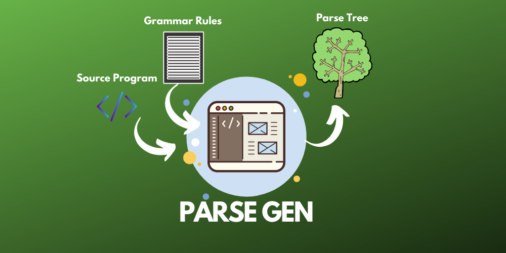
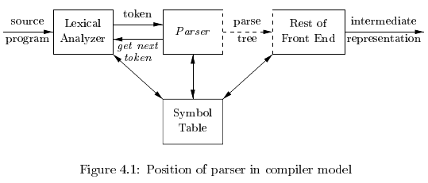
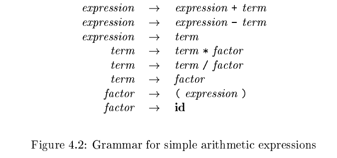
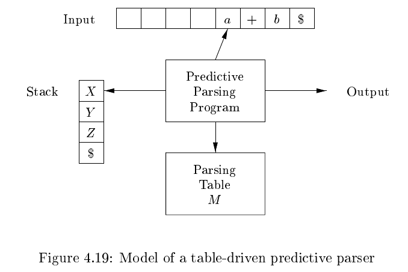
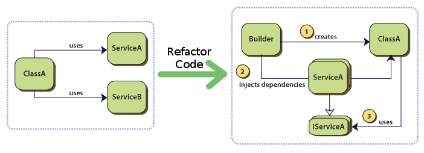

# Parser Generator

PRSGEN is  *phase 2* of a **compiler frontend pipeline**. This work is done as the project for PLT (**P**rogramming **L**anguage **T**ranslation) course at Alexandria University, Faculty of Engineering Computer and Communications Department, offered in Spring 2020.

 Made with <b>love</b> :heart: and <b>hard work</b> :rocket:

**But, What's PARSE GEN really ?**

In our compiler model , the parser obtains a string of tokens from the lexical analyzer, and verifies that the string of token names can be generated by the grammar for the source language. We expect the parser to report any syntax errors in an intelligible fashion and to recover from commonly occurring errors to continue processing the remainder of the program.
Conceptually, for well-formed programs, the parser constructs a parse tree and passes it to the rest of the compiler for further processing.

**Goal of this phase ?**

- Aims to practice techniques for building automatic parser generator tools.
- Design and implement an LL (1) parser generator tool.

We begin the documentation of our PRSGEN by explaining the first component, the **grammar parser**, then we continue to explain the second component which is the **parsing table generator** and the third final component is the **predictive non-recursive parser**. In each component we explain what its goal and job exactly and then give a brief of how internally it works in a some what high level.

---

## Component One: Grammar Parser

The parser generator expects mainly an LL(1) grammar (CFG) as input but we also support elimination of left recursion and applying left factoring transformation.
Grammars were introduced in Section 2.2 from [1] to systematically describe the syntax of programming language constructs like expressions and statements.

A **context-free grammar** (will call just `grammar` from now on for short) consists of terminals, non-terminals, a start symbol, and productions.

### Terminals

Those are the basic symbols from which strings are formed. The token-name from lexical analyzer notation is a synonym for terminal here. We assume that the terminals are the first components of the tokens output by the lexical analyzer.

### Non-terminals

They are syntactic variables that denote sets of strings. The sets of strings denoted by non-terminals help define the language generated by the grammar. Non-terminals impose a hierarchical structure on the language that is key to syntax analysis and translation.

### Start Symbol

It is a distinguished non-terminal. Conventionally, the productions for the start symbol are listed first in the grammar rule.

### Productions

Specify the manner in which the terminals and non-terminals can be combined to form strings. It consists of:

- `Left side of the production`: non-terminal that is being defined by this production. 

- The arrow symbol `->` which is replaced sometimes with `::=` which is our case in our file format. 

- `Right side of the production`: consisting of zero or more terminals and non-terminals. The components of the body describe one way in which strings of the non-terminal at the head can be constructed.

---

### What is an LL(1) Grammar

Predictive parsers, that is, recursive-descent parsers needing no backtracking, can be constructed for a class of grammars called LL(1). The first `L` in LL(1) stands for scanning the input from left to right, the second `L` for producing a leftmost derivation, and the `1` for using one input symbol of lookahead at each step to make parsing action decisions.
The class of LL(1) grammars is rich enough to cover most programming constructs.

For any LL(1) grammar it should be,

- Un-ambiguous
- Non-left recursive
- left-factored

We did *extra work* on our PRSGEN to **support** removing the left recursion and applying left factoring transformation on grammar before calling other components.

### CFG Grammar Input File Format

- CFG input file is a `text` file.

- Production rules are lines in the form `LHS ::= RHS`

- Production rule can be expanded over many lines.

- Each Non terminal definition should start with `#`, and LHS should appear only once in the entire file.

- Terminal symbols are enclosed in single quotes.

- `\L` represents Lambda symbol.

- The symbol `|` is used in RHS of production rules to introduce more than one production for the same non terminal.

- Any reserved symbol needed to be used within the language, is preceded by an `\` escape backslash character.

### Implementation Details 

The Grammar Parser class has three main public methods to use.

- `parseFile(string file_path)` : which reads in the file contents and parses the grammar input into 2 data-structures that are used everywhere in the project later on.

- `eliminateLeftRecursion()` : which operates on the grammar input from file and eliminates the left recursion if any. This method have to be called after `parseFile` method is called and not before that.

- `applyLeftFactoring()` : which operates on the grammar input from file and apply left factoring transformation.This method have to be called after `parseFile` method is called and not before that.

We implemented the algorithms found in Chapter 4 of [1] for left recursion elimination and left factoring transformation. You can head there and read more about the formal algorithms and their intuitions.

The Grammar Parser owns the two data-structures that are used in the system throughout later on.

- `terminals_` : unordered_set of strings that contains all terminals found throughout the file. It is an unordered_set because under the hood such a data structure is implemented as hash table which is the perfect case we need to have fast lookups.

- `non_terminals_` : vector of NonTerminal object that is found throughout the file with their production rules included inside each object.

---

## Component Two: Parsing Table Generator

The construction of both top-down and bottom-up parsers is aided by two functions, **FIRST** and **FOLLOW** , associated with a grammar G. During top-down parsing, FIRST and FOLLOW allow us to choose which production to apply, based on the next input symbol.

We should compute First and Follow sets and uses them to construct a predictive parsing table for the grammar. The table is to be used to drive a predictive top-down parser.

A predictive parsing table M [A; a], is basically a two-dimensional array, where A is a non-terminal, and a is a terminal or the symbol $, the input end-marker. The implementation of such a table was a design issue we should tackle to have the best way we can store it to save time and speed-up performance while having ease of implementation of our algorithms.

---

### How do we implement/store the parsing table

Instead of having an actual table implemented as a data-structure, we build for each non-terminal an entry row stored in the entity. That is as follows:

    std::unordered_map<std::string, int> parse_table_entry_

where, the keys of the map are the string terminal and the values are integer indexes to point at one of the production rules that are associated with this non-terminal object.

For the parsing table generator class we have three methods that are exposed and are to be used in a specific order:

- `computeFirst()` : it computes the FIRST set associated with grammar G which is the input file for **Grammar Parser**. For each non-terminal we keep a set FIRST, the collection of all the FIRST sets from all non-terminals resembles the FIRST set of grammar G. 

- `computeFollow()` : it computes the FOLLOW set associated with grammar G which is the input file for **Grammar Parser**. For each non-terminal we keep a set FOLLOW, the collection of all the FOLLOW sets from all non-terminals resembles the FOLLOW set of grammar G. Only note that it must be called after computeFirst in this current version since it depends on the FIRST set itself. 

- `constructParsingTable()` : this final method constructs the parsing table from the FIRST and FOLLOW sets of all non-terminals and thus as well need to be called after both above method are called first strictly. A future plan is to call both methods internally to avoid such dependency to be known on the user of the low level components (if any).

For each of the above three methods, we implemented the algorithms from Chapter 4 of [1] where you can read more about the formal algorithm.

---

## Component Three: Predictive Non-recursive Parser

**Top-down parsing** can be viewed as the problem of constructing a parse tree for
the input string, starting from the root and creating the nodes of the parse tree in pre-order (depth-first). Equivalently, top-down parsing can be viewed as finding a leftmost derivation for an input string.

At each step of a top-down parse, the key problem is that of determining the production to be applied for a non-terminal.

A general form of top-down parsing, called **recursive-descent parsing**, which may require backtracking to find the correct production to be applied.

A special case of recursive-descent parsing, where no backtracking is required is called **predictive parsing**. Predictive parsing chooses the correct production by looking ahead at the input a fixed number
of symbols, typically we may look only at one (that is, the next input symbol).

A non-recursive predictive parser can be built by maintaining a stack explicitly, rather than implicitly via recursive calls. The parser mimics a leftmost derivation. The table-driven parser in Fig. 4.19 has an input bu er, a stack containing a sequence of grammar symbols, a parsing table constructed from the `parsing table generator` component. 

The input buffer contains the string to be parsed,
followed by the end-marker `$`. We reuse the symbol `$` to mark the bottom of the stack, which initially contains the start symbol of the grammar on top of `$`.
The parser is controlled by a program that considers X, the symbol on top of the stack, and a, the current input symbol. If X is a non-terminal, the parser
chooses an X -production by consulting entry `M[X;a]` of the parsing table M. Otherwise, it checks for a match between the terminal X and current input symbol a.

For the predictive parser class we have only one method to be exposed ( `parse()` ) which implements the flowchart of the parser and works as we discussed above.

---

### Error Recovery in Predictive Parsing

If the input grammar is not LL(1), an appropriate error message should be produced. The generated parser is required to produce some representation of the leftmost derivation for a correct input. If an error is encountered, a **panic-mode error recovery** routine is to be called to print an error message and to resume parsing.

Panic-mode error recovery is based on the idea of skipping over symbols on the input until a token in a selected set of synchronizing tokens appears. Its e effectiveness depends on the choice of synchronizing set. The sets should be chosen so that the parser recovers quickly from errors that are likely to occur
in practice. The compiler designer must supply informative error messages that not only describe the error, they must draw attention to where the error was discovered.

---

### Interaction with Lexical Analyzer Design

We had some design alternatives when discussing the interaction of the parser generator with the lexical analyzer generator. The main ones we were to choose from was as follows:

- **Processes Communication:** running each module independently in a process and providing means for inter-process-communication to exchange tokens.

- **Running in Threads:** A relaxation to the above approach was to run each module ina thread. Threads share memory which would make the exchanging process of tokens a little bit easier. 

In both above cases we would have a pure classic OS problem in our hands. A Producer-Consumer problem, due to our limited time we had to move to a simpler and yet efficient solution to our system.

- **Dependency Injection Design Pattern:** Both modules are not independent which loses isolation but given our goal is to build a full frontend compiler in the first place not every module alone that is quite understandable relaxation to make at this step. Dependency Injection pattern solution simply says that we will inject an instance of the Lexical Analyzer object inside the Parser Generator Object where it depends on it. It keeps asking for next token every while to fill its input buffer. Following this design pattern guarantees quality of code and ease of communication while simplicity in hand and mind over isolation and independence.

---

## References

1. Compilers, Principles, Techniques, & Tools, Second Edition by Alfred V. Aho & Monica S. Lam & Ravi Sethi & Jeffrey D. Ullman

2. Engineering a Compiler, Second Edition by Keith D. Cooper & Linda Torczon.

---
